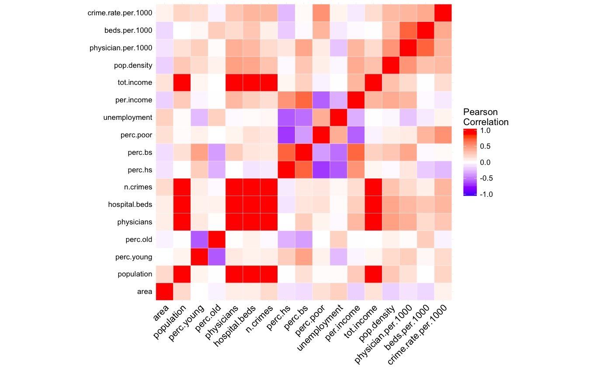

# Analysis of U.S. Regional Crime Rates
### Ziwei Meng, Ao Liu
#### April 29, 2017

## Abstract:
After doing an overview of the dataset provided and setting our goal and procedure, we process the data then build two regression models. We also interpret the variables effect on crime rate prediction. Finally , we present the discoveries from the testing result and give suggestions and some further thoughts.

## Goal and Procedure
1. Using the data given to create a regression model.
2. Based on the model, give suggestions on the reduction of the number of serious crimes in their county.
3. Further thoughts about the findings.

## Model Building
### data Overview
1. Geographic Data: Land Area, Geographic Region Demographic Data: Total population, Percent of population
2. aged 18-34, Percent Bachelor’s Degree
3. Economics Data: Percent Below Poverty Level, Total Personal Income, Per Capita Income

### Data Processing
1. Check for missing values (and substitute them with mean values)
2. Calculate more variables that cater to our needs:
  - Population Density = Population Area
  - Physician Per 1000 Population = Physician Population/1000
  - Hospital Beds Per 1000 Population = HospitalBeds P opulation/1000
  - Crime Rate Per 1000 Population =
Crimes
P opulation/1000
3. Randomly Select 330 rows of data to train the regression model, and the remaining 110 rows are used for testing the accuracy of our model

### Heatmap
- First we explore the correlation of variables:
<!--or like this

-->

- Given 16 predictor variables, some of them are strongly correlated with each other, which will cause us to get some potentially false conclusion, thus we remove these variables.
- The remaining variables are:
*Area, Percentage of Young People, Percentage of Old People, Percentage of High School, Percentage of Bachelor, Percentage of Poor, Unemployment, Income, Region, Population Density, Physician Per 1000 Population, Beds Per 1000 Population*

### Regression Model
- Given the fact that crime rate is a count value, in this question we fit the data to Poisson Regression Model, to reduce the effect of region size, we add offset to the model, and also use quasi-likelihood in order to prevent over dispersion.

- Then we do the significant test for each variable.
- Through the resulting output table from Poisson Regression, the following variables are insignificant:
- area, percent of old people, percent of people with high school education.
- After removing the insignificant variables, we build the Poisson Regression Model again using only the most important variables.

### Outliers
Check Outliers

### Interpretation of Variables Effect on Crime Rate
Here we interpret the meaning of each parameters in our model:
- **percent young**: If we decrease the percent of young people by 1 unit while holding all other variables the same, the crime rate would decrease by a multiplicative factor of 1.017847 on average.
- **percent poor**: If we decrease the percent on poor people by 1 unit while holding all other variables the same, the crime rate would decrease by a multiplicative factor of 1.024423 on average
- **population density**: If we decrease the log of the population density by 1 unit while holding all other variables the same, the crime rate would decrease by a multiplicative factor of 1.085662 on average.
- **region**: Holding all other variables the same, the crime rate in NC is higher than that in NE by a multiplicative factor of 1.347162 on average, the crime rate in S is higher than that in NE by a multiplicative factor of 1.775532 on average, the crime rate in W is higher than that in NE by a multiplicative factor of 1.673471 on average.
- **beds per 1000 population**: If we decrease the density of beds per 1000 people by 1 unit while holding all other variables the same, the crime rate would decrease by a multiplicative factor of 1.049475 on average.

### Prediction on Testing Data
Finally we use the testing data to predict the crime rate of the remaining 110 counties and examine the accuracy of the regression model

### XGboost Model
To further explore the data, we fit our data into XGboost Model:

Discoveries from the Testing Result

The two models both fit the data well
Only several points are outliers, no matter which model we use, so there are some others reasons for their high crime rate that we don’t know the exactly.
Since our client - Kings County is also among the several outliers in both models, we have to do further analysis to find out the hidden reason for its high crime rate. Otherwise, our suggestions may not be applicable to Kings County.

### With and Without Kings County
Building the two kinds of models with and without taking King’s County into consideration, we can see a big difference in the error, meaning that we have to analyze King’s County and other counties separately.

### Most Important Variables without Kings County
Let’s see what are the most important variables using XGBoost without Kings County:

From the chart above we can see that for most of the counties in the U.S., the variables that matter most are percent of poor people, region size, number of physicians per 1000 population and so on.

### Kings County vs other counties in U.S.
Let’s see what are the variables with which Kings County differs most from the others. We can see that among the several variables we focus on, Kings county has a significant high population density, which might be one of the reasons why Kings County has a high crime rate.

### Kings County vs other counties in NY
Assuming counties that are adjacent to each other might have more similarities, we see the difference between Kings County and other counties in the State of New York.

We can see that the biggest difference is still population density. Thus, we analyze population density’s impact on crime rate.

### Population Density

## Suggestions and Further Thoughts
### Suggestions
Based on the value of the parameters, we give the following suggestions to the officials of Kings County:
**General suggestions:**
1. Adopt better policy to raise the income of people.
2. Invest more money on education

**Specific for Kings County:**
1. Control the population density of King’s County:
  It is harder to reduce the population, so we increase the land area: land filling.

### Further Thoughts
Though we have found out the relationship between high population density and high crime rate in King’s County, we want to know why.

**Social Economics reason**
1. *"Crime rates spiked in the 1980s and early 1990s as the crack epidemic hit the city."*
Crime in New York City - Wikipedia
http://bit.ly/2oYXTQQ
2. "New York City Crime in the Nineties - The New Yoker"
http://bit.ly/2os9ZTQ
